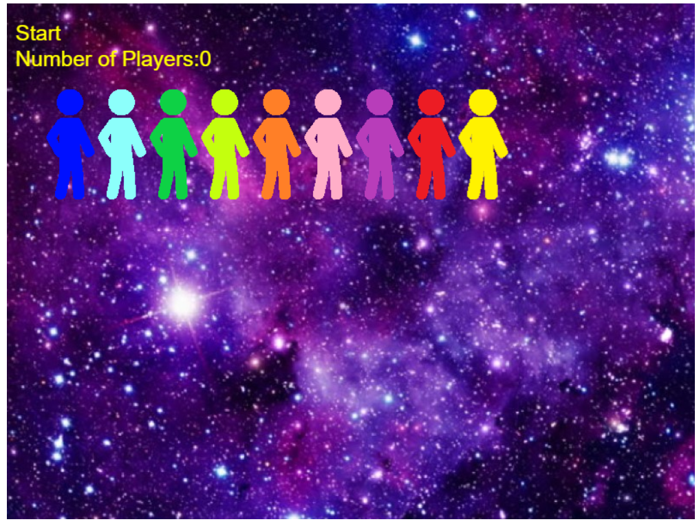
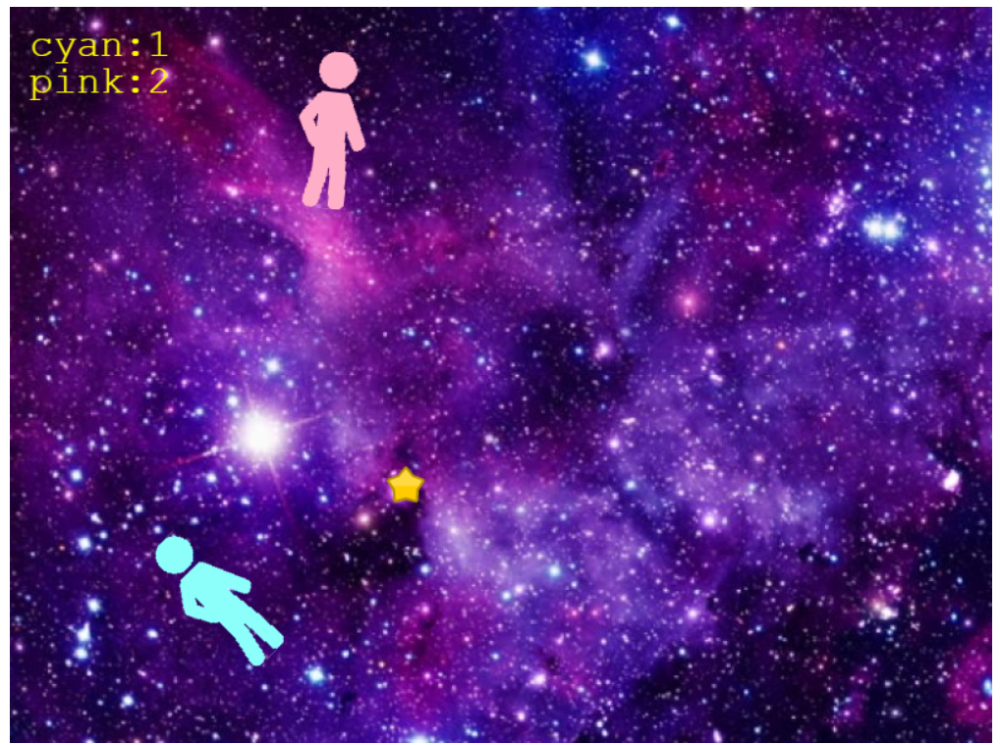

# Radical-Human-Space-Battle

# Presentation

The purpose of this project made with Phaser and Socket.io is to know how socket.io works. 

# Game

*Radical Human Space Battle* consists about a battle between humans in the space. The human who has more stars collected wins.

# Menu 

Here you can choose a player.

# Playing 

To play you have to use the cursors on your keyboard and collect the stars.

Thank you for visiting this repository! You can give me a star like the game!
